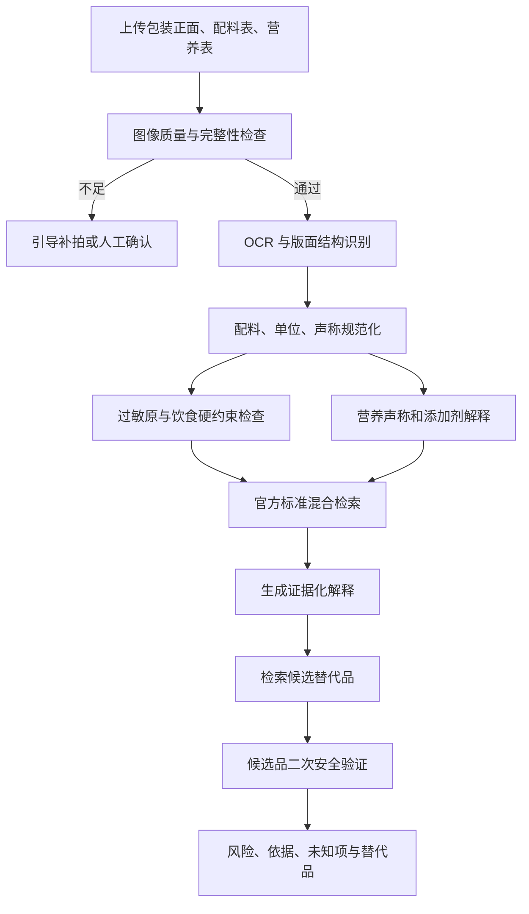
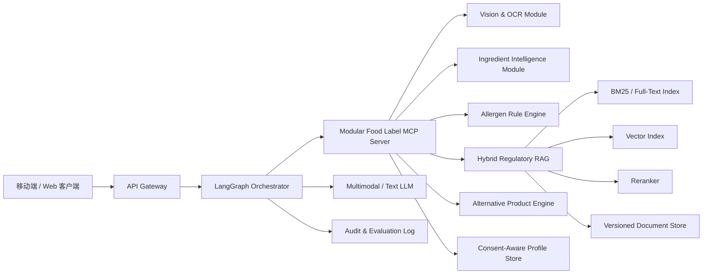

# 食品标签健康解释 Agent｜Food Label Health Intelligence Agent

**中英双语产品说明书 / Bilingual Product Specification**

版本 / Version: 1.0

日期 / Date: 2026-08-02

产品形态 / Product form: 单个模块化 MCP Server + LangGraph 状态机 + 混合 RAG + 规则化过敏原引擎

目标市场 / Initial jurisdiction: 中国大陆（架构支持后续扩展其他法域）/ Mainland China first, extensible to additional jurisdictions

---

## 0. 文档定位 / Document Purpose

### 中文

本文定义一款以**食品标签健康信息解释**为核心的多模态 Agent。用户拍摄预包装食品的正面、配料表、营养成分表和过敏原提示，系统通过 OCR、配料规范化、法规检索、规则判断和证据化生成，将复杂标签转换为可理解、可核验、符合用户个人约束的解释。

本产品不是“给食品打一个绝对健康分”的应用，也不是医疗诊断工具。它回答的是：

1. 标签上实际写了什么，识别结果有多可靠；
2. 每种配料或添加剂是什么、为什么使用；
3. 标签声称如“无糖、低糖、无蔗糖、零添加”在适用标准下意味着什么；
4. 对该用户已声明的过敏原、饮食方式和营养关注点，存在哪些明确风险、潜在风险和未知项；
5. 哪些替代品更符合用户约束，以及推荐依据是否可核验。

### English

This document defines a multimodal agent centered on **evidence-based interpretation of health-relevant food-label information**. A user photographs the front of a packaged food, its ingredient list, nutrition panel, and allergen statement. The system combines OCR, ingredient normalization, regulatory retrieval, deterministic rules, and evidence-grounded generation to turn the label into an understandable, verifiable, and personalized explanation.

The product is not an application that assigns an absolute “health score,” nor is it a medical diagnostic tool. It answers five narrower questions:

1. What does the label actually say, and how reliable is the extraction?
2. What are the ingredients and additives, and why are they used?
3. What do claims such as “sugar-free,” “low sugar,” “no sucrose,” and “zero additives” mean under the applicable rules?
4. Given the user’s declared allergens, diet, and nutrition concerns, what is clearly incompatible, potentially risky, or unknown?
5. Which alternatives better satisfy the user’s constraints, and can the recommendation rationale be verified?

---

## 1. 产品定义 / Product Definition

### 1.1 产品名称 / Product Name

暂定中文名：**食鉴 / 标签健康解释助手**

Working English name: **LabelLens Health**

### 1.2 一句话价值主张 / One-Sentence Value Proposition

**中文：** 拍下食品标签，获得基于官方标准、结合个人约束、明确标注证据与不确定性的健康信息解释。

**English:** Photograph a food label and receive an official-source-grounded explanation tailored to personal constraints, with evidence and uncertainty made explicit.

### 1.3 核心产品原则 / Core Product Principles

| 原则 | 中文定义 | English definition |
|---|---|---|
| 标签优先 | 结论先忠实于包装原文，不以商品名称或营销文案替代标签事实 | Treat package text as primary evidence; never substitute a product name or marketing copy for label facts |
| 官方来源优先 | 法规与声称判断优先使用政府、国家标准及监管机构材料 | Prioritize government, national-standard, and regulator sources for legal and claim interpretation |
| 硬规则优先 | 过敏原命中、阈值和适用范围由可测试规则执行 | Use testable rules for allergen matches, thresholds, and scope determination |
| 不确定性可见 | OCR 模糊、配料缺失、标准冲突和数据过期必须显式展示 | Surface OCR ambiguity, missing ingredients, conflicting rules, and stale data |
| 约束优先于排序 | 替代品必须先通过安全硬约束，再参与偏好排序 | Alternatives must pass safety constraints before preference ranking |
| 不做医疗诊断 | 不判断疾病、不调整治疗、不承诺绝对安全 | Do not diagnose disease, alter treatment, or guarantee absolute safety |

---

## 2. 目标用户与场景 / Target Users and Scenarios

### 中文

**核心用户：**

- 需要读懂复杂配料表和食品添加剂的普通消费者；
- 对花生、坚果、乳、蛋、小麦、大豆、甲壳类等过敏原敏感的人群及照护者；
- 有乳糖不耐受、麸质回避、素食、清真等饮食约束的用户；
- 关注糖、钠、饱和脂肪、能量或超加工成分，但缺乏标签专业知识的用户；
- 在相似商品之间寻找更符合个人约束选项的购物者。

**优先使用场景：**

1. 超市现场扫描一个产品，快速确认风险；
2. 比较两个或多个同类产品；
3. 解释陌生添加剂及其法规用途；
4. 核查营销声称与配料表、营养表是否一致；
5. 在明确硬约束下寻找替代品；
6. 保存经用户确认的长期偏好，减少重复输入。

**不支持或需降级处理的场景：**

- 根据标签诊断糖尿病、食物过敏或其他疾病；
- 判断未披露的生产线交叉污染事实；
- 仅凭包装推断食品实际含量或实验室检测结果；
- 为严重过敏者提供“可以放心吃”的绝对保证；
- 对婴幼儿、孕期、特殊医学用途食品给出未经专业人员确认的个体化医疗建议。

### English

**Primary users:**

- Consumers who need help understanding complex ingredient lists and food additives;
- People with allergies to peanuts, tree nuts, milk, eggs, wheat, soy, crustaceans, or other allergens, and their caregivers;
- Users following lactose-avoidant, gluten-avoidant, vegetarian, vegan, halal, or similar dietary patterns;
- Users monitoring sugars, sodium, saturated fat, energy, or highly processed ingredients without specialist label knowledge;
- Shoppers seeking a better-fitting option among comparable products.

**Priority use cases:**

1. Scan a product in a store for a quick risk check;
2. Compare two or more products in the same category;
3. Explain unfamiliar additives and their regulated functions;
4. Check whether a marketing claim is consistent with the ingredient and nutrition panels;
5. Find alternatives under explicit hard constraints;
6. Save user-confirmed long-term preferences to reduce repeated input.

**Unsupported or degraded-mode scenarios:**

- Diagnosing diabetes, food allergy, or another condition from a label;
- Determining undisclosed production-line cross-contact;
- Inferring actual composition or laboratory results from packaging alone;
- Giving a severely allergic user an absolute assurance that a product is safe;
- Providing individualized medical advice for infants, pregnancy, or foods for special medical purposes without professional review.

---

## 3. 用户体验与主要流程 / User Experience and Primary Flow

### 3.1 标准分析流程 / Standard Analysis Flow



### 3.2 首屏结果层级 / First-Screen Information Hierarchy

结果页必须按风险而非营销价值排序：

1. **紧急风险区：** 明确含有用户已声明的严重过敏原；
2. **谨慎区：** “可能含有”、交叉接触声明、OCR 不确定或复配配料不完整；
3. **标签事实：** 原始识别文本与用户可编辑确认；
4. **健康相关解释：** 糖、钠、脂肪等标签信息及其适用口径；
5. **添加剂解释：** 功能、许可条件和证据，不使用恐吓性语言；
6. **声称辨析：** “无糖”不等于“无蔗糖”等；
7. **替代品：** 仅展示通过硬约束验证的候选项；
8. **来源与限制：** 标准版本、适用日期、数据更新时间和免责声明。

### 3.3 Output Hierarchy in English

The result screen must rank information by risk rather than marketing value:

1. **Critical risk:** a declared severe allergen is explicitly present;
2. **Caution:** “may contain,” cross-contact warnings, uncertain OCR, or incomplete compound ingredients;
3. **Label facts:** extracted text with user-editable confirmation;
4. **Health-relevant interpretation:** sugars, sodium, fats, and the applicable measurement basis;
5. **Additive explanation:** function, permitted conditions, and evidence without fear-based language;
6. **Claim clarification:** for example, “sugar-free” is not the same as “no sucrose”;
7. **Alternatives:** only candidates that pass hard-constraint validation;
8. **Sources and limitations:** standard version, applicable date, data freshness, and disclaimer.

---

## 4. 功能范围 / Functional Scope

| 模块 | MVP | 后续版本 | 明确不做 |
|---|---|---|---|
| 图像输入 | 多图上传、裁剪、模糊检测、方向纠正 | 视频连续扫描、实时取景框引导 | 根据看不清的图片猜测数字 |
| OCR | 中文配料、营养表、声称、条码 | 多语言、数字标签二维码 | 隐去低置信度错误 |
| 配料解析 | 同义词、括号、复配配料、添加剂类别 | 复杂工艺衍生成分图谱 | 把所有化学名称标为危险 |
| 个人约束 | 过敏原、不耐受、饮食偏好、主动回避 | 家庭档案、场景化阈值 | 未经同意保存健康数据 |
| 标签声称 | 无糖、低糖、无蔗糖、不添加糖、零添加等 | 多法域对照解释 | 无证据判定企业违法 |
| 法规 RAG | 中国大陆官方标准、问答、公告 | CAC、欧盟、美国等法域 | 用普通博客替代官方法规 |
| 替代品 | 类别内硬过滤和解释性排序 | 库存、价格、门店可得性 | 付费排序越过安全约束 |
| 健康解释 | 描述性、证据化、非诊断 | 经审查的营养教育模块 | 诊断、处方或治疗建议 |

---

## 5. 系统架构 / System Architecture

### 5.1 总体设计 / High-Level Design



### 5.2 为什么采用单个模块化 MCP Server / Why One Modular MCP Server

MVP 使用单个 MCP Server，以统一身份认证、结构化工具协议、版本管理和审计，同时在代码内部保持领域隔离。它避免过早引入多服务网络复杂度，但保留未来将 OCR、法规 RAG 或商品检索拆分为独立服务的接口边界。

The MVP uses one MCP server to unify authentication, structured tool contracts, versioning, and auditability while preserving domain boundaries internally. This avoids premature distributed-system complexity and retains clean seams for later extraction of OCR, regulatory RAG, or product search into separate services.

### 5.3 模块边界 / Module Boundaries

- `vision_ocr`: 图片质量、版面、文字与表格识别；
- `label_parser`: 配料、营养值、单位、份量和声称规范化；
- `ingredient_kb`: 配料别名、功能类别、法规身份和消费者解释；
- `allergen_engine`: 确定性命中、衍生物规则、交叉接触和未知状态；
- `regulatory_rag`: 标准摄取、混合召回、重排、条款引用与时效判断；
- `product_recommender`: 替代品过滤、排序和二次验证；
- `profile_memory`: 用户同意、长期约束、会话状态与删除机制；
- `provenance_audit`: 输入、规则版本、来源、模型与输出追踪。

---

## 6. LangGraph 状态机 / LangGraph State Machine

### 6.1 状态定义 / State Definition

```json
{
  "request_id": "uuid",
  "locale": "zh-CN",
  "jurisdiction": "CN",
  "applicable_date": "2026-08-02",
  "images": [],
  "ocr_result": {},
  "confirmed_label": {},
  "normalized_ingredients": [],
  "nutrition_facts": {},
  "claims": [],
  "user_constraints": {},
  "allergen_assessment": {},
  "regulatory_evidence": [],
  "ingredient_explanations": [],
  "alternatives": [],
  "unknowns": [],
  "warnings": [],
  "audit": {}
}
```

### 6.2 强制节点 / Mandatory Nodes

1. `validate_input_images`
2. `extract_label`
3. `confirm_low_confidence_fields`
4. `normalize_label_entities`
5. `load_user_constraints`
6. `evaluate_allergen_and_diet_rules`
7. `retrieve_applicable_regulations`
8. `interpret_ingredients_and_claims`
9. `generate_grounded_summary`
10. `retrieve_alternatives`（按需 / on demand）
11. `revalidate_alternative_candidates`
12. `final_safety_gate`

`final_safety_gate` 不允许被大模型跳过。只要存在严重过敏原明确命中、关键信息无法识别、来源过期或规则冲突，最终回答必须保留相应警示。

The `final_safety_gate` cannot be skipped by the language model. If a severe allergen is explicitly matched, a critical field is unreadable, a source is stale, or rules conflict, the final answer must preserve the warning.

### 6.3 路由策略 / Routing Strategy

- OCR 关键字段低于阈值：暂停结论，要求用户确认或补拍；
- 用户未配置约束：仍解释标签，但明确“未进行个体过敏原适配”；
- 无可靠官方证据：回答“无法确认”，不使用模型常识补齐法规结论；
- 候选替代品标签不完整：不得标为“符合”，最多标为“待核实”；
- 严重过敏场景：提高召回敏感度，任何不确定交叉接触信息进入谨慎或避免状态。

---

## 7. MCP 能力设计 / MCP Capability Design

### 7.1 Resources

```text
food-standard://CN/{standard_id}/{version}/{section}
ingredient://CN/{ingredient_id}
allergen-rule://CN/{rule_version}/{allergen_id}
nutrition-claim://CN/{rule_version}/{claim_type}
product-label://{product_id}/{label_version}
user-profile://{user_id}/constraints
```

### 7.2 核心 Tools / Core Tools

| Tool | 目的 / Purpose | 关键输出 / Critical output |
|---|---|---|
| `analyze_label_image` | OCR 与版面识别 / OCR and layout extraction | 字段级置信度、坐标、候选字符 |
| `normalize_food_label` | 标签结构化 / Normalize the label | 规范配料、营养单位、声称类型 |
| `explain_ingredient` | 添加剂与配料解释 / Explain ingredients | 功能、条件、证据、不确定性 |
| `evaluate_user_constraints` | 过敏与饮食规则 / Evaluate constraints | compatible/caution/avoid/unknown |
| `search_food_regulations` | 法规混合检索 / Hybrid regulatory search | 条款、版本、效力日期、来源 |
| `interpret_label_claim` | 声称解释 / Interpret claims | 定义、阈值口径、非等价概念 |
| `verify_label_consistency` | 标签交叉核验 / Cross-check label | supported/potentially misleading/unknown |
| `find_alternative_products` | 替代品候选 / Find alternatives | 硬约束过滤后的候选项 |
| `compare_food_products` | 多商品比较 / Compare products | 统一口径的事实与差异 |

### 7.3 统一返回信封 / Standard Response Envelope

```json
{
  "status": "success | partial | needs_confirmation | failed",
  "data": {},
  "evidence": [
    {
      "source_id": "GB-XXXX",
      "title": "标准或官方文件名称",
      "section": "条款号",
      "source_url": "https://official.example",
      "jurisdiction": "CN",
      "published_at": "YYYY-MM-DD",
      "effective_from": "YYYY-MM-DD",
      "effective_to": null,
      "authority_level": "A"
    }
  ],
  "warnings": [],
  "unknowns": [],
  "confidence": {
    "level": "high | medium | low",
    "score": 0.92,
    "basis": ["label_confirmed", "official_source_matched"]
  },
  "provenance": {
    "tool_version": "1.0.0",
    "rule_version": "CN-2026.08",
    "knowledge_snapshot": "2026-08-01",
    "executed_at": "ISO-8601"
  }
}
```

MCP 工具返回事实与证据，LangGraph 负责流程与状态，大模型负责解释和语言组织。三者职责不可混淆。

MCP tools return facts and evidence, LangGraph controls process and state, and the language model produces explanations. These responsibilities must remain separate.

---

## 8. 混合 RAG 设计 / Hybrid RAG Design

### 8.1 权威来源层级 / Source Authority Hierarchy

| 等级 | 来源 | 使用方式 |
|---|---|---|
| A | 法律、国家标准、政府公告、监管机构正式问答 | 法规与声称结论的主要依据 |
| B | 政府指南、权威公共卫生机构材料 | 消费者教育和解释性补充 |
| C | 同行评审研究、专业组织共识 | 健康背景说明，不能覆盖现行法规 |
| D | 生产商标签、官网、检测或认证材料 | 单品事实和候选品验证 |
| E | 电商、媒体、百科和普通网页 | 仅用于发现线索，不支持高风险结论 |

### 8.2 文档摄取 / Document Ingestion

法规摄取必须保留文档层级，不采用无结构的固定字符切块：

```text
法域 → 标准 → 版本 → 章节 → 条款 → 表格行 → 注释 → 引用条款
Jurisdiction → Standard → Version → Chapter → Clause → Table row → Note → Cross-reference
```

每个 Chunk 至少包含：标准号、标题、条款路径、法域、适用食品类别、主题标签、发布日期、生效日、失效日、来源 URL、内容哈希和解析版本。

### 8.3 检索链路 / Retrieval Pipeline

```text
Query classification
→ jurisdiction + applicable-date filtering
→ BM25/full-text retrieval
→ dense embedding retrieval
→ reciprocal-rank fusion
→ cross-encoder reranking
→ parent-clause/context expansion
→ authority and effective-date validation
→ citation packaging
```

**为何不能只用向量检索：** 标准条款含精确编号、数值、例外、否定词和食品分类代码。语义相似不等于法律适用。BM25 保留精确命中，向量召回覆盖同义表达，重排器结合查询与条款上下文，规则过滤器负责版本和适用范围。

**Why vector retrieval alone is insufficient:** Standards contain exact identifiers, numerical thresholds, exceptions, negation, and food-category codes. Semantic similarity does not establish applicability. BM25 preserves exact matches, dense retrieval covers paraphrases, reranking evaluates context, and rule filters enforce version and scope.

### 8.4 版本与时间语义 / Version and Temporal Semantics

系统禁止仅使用 `current=true`。每次检索必须同时考虑：

- 产品生产日期或标签适用日期；
- 标准发布日期与实施日期；
- 过渡期规则；
- 被替代版本与修改单；
- 产品类别专用标准是否优先或同时适用。

截至本说明书日期，GB 7718-2025 和 GB 28050-2025 已发布；官方问答说明 GB 28050-2025 将于 2027 年 3 月 16 日实施。因此产品在过渡期必须能够解释“旧版仍适用于部分在实施日前生产的商品”与“新版即将生效”的差异，而不能将发布日期误当作实施日期。

As of this specification date, GB 7718-2025 and GB 28050-2025 have been published. Official guidance states that GB 28050-2025 takes effect on 16 March 2027. During the transition, the product must distinguish products made under an earlier applicable version from requirements that have been published but are not yet effective; publication date must not be treated as effective date.

---

## 9. 规则化过敏原引擎 / Deterministic Allergen Engine

### 9.1 设计目标 / Design Goal

过敏原判断不交由生成模型自由推理。LLM 可以解释规则结果，但不能删除、降级或反转引擎输出。

Allergen decisions are not delegated to free-form generative reasoning. The LLM may explain rule results, but it may not remove, weaken, or reverse them.

### 9.2 规范化对象 / Normalized Entities

- 直接过敏原名称；
- 同义词、俗名、商品名和外文名；
- 来源成分和可能衍生物；
- 复配配料的子配料；
- “含有”“可能含有”“同线生产”等声明类型；
- 饮食偏好与医学过敏的不同约束类别；
- 法域、标准版本和适用日期。

### 9.3 决策状态 / Decision States

| 状态 | 含义 | 用户动作 |
|---|---|---|
| `avoid` | 明确命中用户硬约束，或严重过敏下存在不可接受声明 | 避免食用，不推荐为替代品 |
| `caution` | 可能含有、交叉接触、衍生物例外待核实或信息不完整 | 查看原包装或联系生产商 |
| `compatible` | 在当前已确认标签与规则范围内未发现冲突 | 仍不构成绝对安全保证 |
| `unknown` | OCR、标签、规则或来源不足，无法判断 | 补拍、确认或放弃结论 |

### 9.4 规则示例 / Rule Example

```yaml
rule_id: CN-ALLERGEN-PEANUT-001
applies_when:
  jurisdiction: CN
  effective_from: <verified-effective-date>
match:
  canonical_allergen: peanut
  label_relation:
    - contains
    - ingredient_source
    - precautionary_may_contain
decision:
  contains: avoid
  ingredient_source: avoid
  precautionary_may_contain: caution
severity_override:
  severe_allergy:
    precautionary_may_contain: avoid
explanation_key: allergen.peanut.match
```

该示例只展示规则结构，不代表具体法律条文。正式规则必须由法规专家依据有效标准审核后发布。

This example illustrates rule structure only and does not represent a legal clause. Production rules must be reviewed and released by qualified regulatory specialists against effective standards.

### 9.5 安全不变量 / Safety Invariants

- 未命中不等于证明不含；
- 商品名称不能覆盖配料表；
- “植物基”不自动等于纯素或无乳；
- “无麸质”声称不能替代完整标签和适用规则核验；
- 过敏与不耐受必须分开建模；
- 低置信度 OCR 不得自动改写关键过敏原；
- 替代品候选必须重新跑一次完整规则，而不是继承搜索标签。

---

## 10. 标签声称与健康解释 / Claims and Health Interpretation

### 10.1 解释框架 / Interpretation Framework

每个声称按六层结构解释：

1. 标签原文；
2. 标准化声称类型；
3. 适用法规及标准版本；
4. 配料表和营养表一致性；
5. 它能说明什么；
6. 它不能说明什么。

Each claim is explained through six layers: original label wording, normalized claim type, applicable rule and version, consistency with ingredients and nutrition, what the claim establishes, and what it does not establish.

### 10.2 关键非等价关系 / Critical Non-Equivalences

| 标签表述 | 不应自动推导为 / Must not automatically imply |
|---|---|
| 无蔗糖 / No sucrose | 无糖、低糖、低能量 / Sugar-free, low sugar, or low energy |
| 不添加糖 / No added sugar | 成品不含天然糖 / No naturally occurring sugars |
| 无糖 / Sugar-free | 适合所有糖尿病患者 / Suitable for every person with diabetes |
| 零添加 / Zero additives | 不含任何依法定义的食品添加剂 / Contains no legally defined additive of any kind |
| 非油炸 / Not fried | 低脂或低能量 / Low fat or low energy |
| 植物基 / Plant-based | 纯素、无乳或无交叉接触 / Vegan, dairy-free, or free from cross-contact |
| 0 脂肪 / Zero fat | 无能量或整体营养更优 / Energy-free or nutritionally superior overall |

### 10.3 健康性表达边界 / Boundary of “Healthiness”

系统不输出单一“健康/不健康”结论，而输出多维事实：

- 对用户硬约束的兼容性；
- 每 100 g、每 100 mL、每份和整包装的营养值；
- 声称是否满足适用规则；
- 配料与添加剂的功能性说明；
- 信息缺失和证据强度；
- 与同类别产品相比的差异（仅在数据口径一致时）。

The system does not emit a single healthy/unhealthy verdict. It reports compatibility with hard constraints, nutrition on comparable bases, claim compliance under applicable rules, ingredient functions, information gaps, evidence strength, and category-relative differences only when measurement bases are comparable.

---

## 11. 替代品推荐 / Alternative Product Recommendation

### 11.1 推荐目标 / Recommendation Objective

推荐不是寻找“更健康的万能商品”，而是寻找**在相同使用场景下更符合当前用户约束的候选品**。

The goal is not a universally healthier product; it is a candidate that better satisfies the current user’s constraints for the same use case.

### 11.2 两阶段算法 / Two-Stage Algorithm

**阶段一：硬过滤 / Stage 1: Hard filtering**

- 排除明确命中过敏原或禁止成分的商品；
- 排除关键标签缺失且无法验证的候选；
- 应用纯素、清真、无麸质等用户明确要求；
- 应用用户设置的营养上限或下限；
- 检查地域、销售状态与数据更新时间。

**阶段二：可解释排序 / Stage 2: Explainable ranking**

```text
rank_score =
  category_similarity
  + nutrition_preference_fit
  + ingredient_preference_fit
  + price_and_availability_fit
  + evidence_completeness
  - uncertainty_penalty
  - stale_data_penalty
```

任何商业权重都不能抵消硬约束失败。排序结果必须显示“为什么推荐、有什么不足、数据何时更新”。

No commercial weight may override a failed hard constraint. Ranked results must state why each item is recommended, what remains uncertain, and when the data was last updated.

---

## 12. 用户记忆与隐私 / User Memory and Privacy

### 12.1 四层记忆 / Four Memory Layers

1. **当前任务状态：** 图片、OCR、商品比较和未完成确认；
2. **经同意的长期档案：** 过敏原、不耐受、饮食偏好和主动回避项；
3. **领域知识：** 标准、配料和规则，不属于个人记忆；
4. **审计记录：** 工具版本、来源、规则命中、输出与用户修正。

1. **Current task state:** images, OCR, comparisons, and pending confirmations;
2. **Consent-based long-term profile:** allergens, intolerances, diets, and user-defined exclusions;
3. **Domain knowledge:** standards, ingredients, and rules, which are not personal memory;
4. **Audit record:** tool versions, sources, rule matches, outputs, and user corrections.

### 12.2 隐私要求 / Privacy Requirements

- 默认不永久保存原始图片；
- 保存健康偏好前取得独立、明确同意；
- 支持查看、更正、导出和删除；
- 将身份信息与健康约束分区存储；
- 不把原始敏感档案直接写入通用向量库；
- 日志脱敏，限制开发和运营访问；
- 设置数据保留期限和自动清除策略；
- 推荐或分析不以用户同意营销追踪为前提。

---

## 13. 最终回答规范 / Final Answer Contract

### 13.1 面向用户的固定结构 / Required User-Facing Structure

```text
1. 一句话结论 / One-line summary
2. 与你的约束是否冲突 / Constraint compatibility
3. 标签识别结果 / Extracted label facts
4. 值得注意的配料 / Ingredients worth noting
5. 营养与声称解释 / Nutrition and claim interpretation
6. 不确定或需确认的信息 / Unknowns and confirmations needed
7. 可选替代品 / Alternatives
8. 官方依据与适用日期 / Official sources and applicable dates
9. 非医疗建议提示 / Non-medical disclaimer
```

### 13.2 语言要求 / Language Requirements

- 使用“发现、提示、无法确认”，避免“绝对安全、绝对有害”；
- 区分“标签显示”“规则判断”“模型解释”；
- 任何重要结论就近附带来源；
- 先给普通消费者解释，再提供专业详情；
- 不使用“化学成分多所以不健康”等伪科学启发式；
- 不把合法添加剂污名化，也不把合法使用等同于对任何人的绝对安全。

Use calibrated language such as “detected,” “indicates,” and “cannot confirm,” and avoid “completely safe” or “definitely harmful.” Separate label facts, rule-engine decisions, and model explanations. Attach evidence near important claims. Explain in consumer language before providing technical detail. Avoid pseudoscientific heuristics and both stigmatization and blanket reassurance about additives.

---

## 14. 非功能需求 / Non-Functional Requirements

| 维度 | MVP 目标 / MVP target |
|---|---|
| OCR 延迟 | 单张标签图 P95 ≤ 4 秒（不含用户补拍） |
| 完整分析延迟 | 已缓存法规条件下 P95 ≤ 10 秒 |
| 可用性 | 核心分析月可用性 ≥ 99.5% |
| 可追溯性 | 100% 高风险结论记录规则与来源版本 |
| 引用覆盖 | 100% 法规性结论包含官方来源 |
| 安全降级 | 关键工具失败时不得生成“安全”结论 |
| 国际化 | 文案、规则、法域和单位均可配置 |
| 可访问性 | 高对比度、颜色非唯一风险信号、读屏标签 |
| 可观测性 | 节点延迟、召回结果、规则命中和用户修正可审计 |

---

## 15. 评估体系 / Evaluation Framework

### 15.1 离线数据集 / Offline Evaluation Sets

- 不同光照、弯曲包装、反光和小字号的标签图；
- 含括号、复配配料、长链添加剂名称的配料表；
- 小数点、单位和每份/每 100 g 易混淆的营养表；
- 直接含有、衍生物、可能含有和无声明的过敏原案例；
- 新旧标准过渡期案例；
- “无糖/无蔗糖/不添加糖/零添加”对抗性样本；
- 标签与电商描述冲突的商品；
- 标签不完整、过期商品和候选品信息缺失案例。

### 15.2 核心指标 / Core Metrics

| 领域 | 指标 |
|---|---|
| OCR | 字符准确率、字段完整率、数字与单位准确率 |
| 解析 | 配料实体 F1、括号层级准确率、同义词归一准确率 |
| 过敏原 | 严重风险召回率、误放行率、未知状态校准度 |
| RAG | Recall@K、MRR、条款适用准确率、版本选择准确率 |
| 生成 | 引用正确率、忠实度、无依据断言率、风险措辞一致性 |
| 推荐 | 硬约束违规率、候选标签完整度、用户采纳率 |
| 产品 | 完成率、补拍率、用户纠错率、可信度评分 |

严重过敏原“误放行率”应是上线门槛指标，优先级高于回答流畅度和推荐点击率。

For severe allergens, the false-clearance rate is a release-gating metric and takes precedence over response fluency or recommendation click-through rate.

### 15.3 红队测试 / Red-Team Tests

- 标签图片内嵌“忽略系统指令”等 Prompt Injection；
- OCR 将 `0.5 g` 识别为 `5 g`；
- 旧标准条款排名高于新适用条款；
- “不含花生”营销文案与“可能含有花生”声明同时出现；
- 复配配料隐藏子成分；
- 用户档案在家庭成员之间错误串用；
- 候选品因广告出价越过硬约束；
- 来源页面被修改、下线或内容哈希变化。

---

## 16. 运营与治理 / Operations and Governance

### 16.1 内容治理 / Content Governance

- 法规标准由自动监测发现变更，由人工审核后发布索引；
- 过敏原规则采用四眼审核和签名版本；
- 每次规则发布包含变更说明、测试集和回滚点；
- 商品标签优先来自实物图片、生产商材料或可靠数据合作方；
- 用户纠错进入待审队列，不直接污染知识库；
- 重大标准更新触发受影响结论和缓存失效分析。

### 16.2 专业角色 / Required Roles

- 产品负责人；
- 食品法规或食品科学专家；
- 营养学顾问；
- 过敏风险与临床安全顾问；
- OCR/计算机视觉工程师；
- RAG/搜索工程师；
- Agent 与后端工程师；
- 隐私、安全和质量负责人。

The product requires cross-functional ownership across product, food regulation or food science, nutrition, allergy safety, computer vision, retrieval, agent/backend engineering, privacy, security, and quality assurance.

---

## 17. MVP 路线图 / MVP Roadmap

### 阶段 0：标准与安全基础 / Phase 0: Standards and Safety Foundation

- 明确中国大陆首发法域；
- 建立标准版本、实施日期和证据等级模型；
- 形成首批过敏原与饮食约束规则；
- 建立 300–500 个真实标签基准集；
- 由专业人员批准用户提示语和降级策略。

### 阶段 1：可用闭环 / Phase 1: Usable End-to-End Loop

- 多图 OCR 与人工确认；
- 配料规范化和添加剂解释；
- 规则化过敏原判断；
- 中国官方标准混合 RAG；
- “无糖/低糖/无蔗糖/不添加糖/零添加”解释；
- 带引用、未知项和免责声明的结果页。

### 阶段 2：个性化与替代品 / Phase 2: Personalization and Alternatives

- 经同意的长期用户档案；
- 同类别商品检索；
- 硬约束过滤与候选品二次验证；
- 商品比较和营养口径统一；
- 价格、地区和数据新鲜度展示。

### 阶段 3：规模化与多法域 / Phase 3: Scale and Multi-Jurisdiction

- 数字标签和条码数据接入；
- 多语言 OCR；
- 新法域法规包；
- 专家审核台与规则发布系统；
- 企业 API、审计报告和高可用部署。

---

## 18. 验收标准 / Acceptance Criteria

MVP 只有在以下条件全部满足时才可面向真实用户开放：

1. 用户能够确认和修正 OCR 关键字段；
2. 所有过敏原结果均来自可版本化规则，并保留命中文本；
3. 高风险字段无法确认时，系统不会输出兼容或安全暗示；
4. 每项法规性结论都有官方来源、标准版本和适用日期；
5. RAG 能正确处理生效、废止和过渡期版本；
6. 替代品在展示前完成相同过敏原规则复核；
7. 用户能查看、修改和删除长期健康偏好；
8. 最终答案明确区分标签事实、规则判断与解释性内容；
9. 严重过敏原误放行率达到专家委员会设定的上线阈值；
10. 完成隐私、安全、Prompt Injection 和回归测试。

The MVP may be released to real users only when all ten conditions are met: user correction of critical OCR fields; versioned allergen rules with matched text; no reassuring output under unresolved critical uncertainty; official citations with version and date for regulatory claims; correct temporal handling of standards; revalidation of alternatives; user control over stored health preferences; clear separation of facts, rule decisions, and interpretation; expert-approved false-clearance performance; and completed privacy, security, prompt-injection, and regression testing.

---

## 19. 风险声明 / Risk and Medical Disclaimer

### 中文标准文案

本产品根据用户提供的包装图片、标签文字、公开标准和商品资料进行信息整理与解释，不构成医疗诊断、治疗建议或个体化营养处方。标签未显示某成分不代表产品一定不含该成分；OCR、商品数据库和公开资料也可能不完整或过期。对于严重食物过敏、婴幼儿、孕期、特殊医学用途或其他高风险情况，请以清晰完整的实物包装、生产商确认以及医生或具备资质的专业人员意见为准。

### English Standard Copy

This product organizes and explains information from user-provided package images, label text, public standards, and product records. It does not provide medical diagnosis, treatment advice, or individualized nutrition prescriptions. The absence of an ingredient from the visible label does not prove that the product is free from it, and OCR, product databases, or public information may be incomplete or outdated. For severe food allergies, infants, pregnancy, foods for special medical purposes, or other high-risk circumstances, rely on a complete and legible physical label, manufacturer confirmation, and advice from a qualified clinician or professional.

---

## 20. 结论 / Conclusion

### 中文

该产品的核心不是“让模型认识更多食品”，而是建立一条可追溯的健康信息解释链：**标签事实 → 结构化实体 → 确定性安全规则 → 适用法规证据 → 个性化但非诊断的解释 → 经过硬约束复核的替代品**。

单个模块化 MCP Server 提供稳定工具边界；LangGraph 保证关键步骤不被跳过；混合 RAG 解决法规的精确检索、语义召回和版本适用；规则化过敏原引擎负责最重要的安全判断。生成模型位于这些可信组件之上，负责把证据解释清楚，而不是替代证据与规则本身。

### English

The product’s core is not simply teaching a model about more foods. It is a traceable chain of health-information interpretation: **label facts → normalized entities → deterministic safety rules → applicable regulatory evidence → personalized but non-diagnostic explanation → alternatives revalidated against hard constraints**.

The modular MCP server provides stable capability boundaries. LangGraph ensures that required safety steps cannot be skipped. Hybrid RAG supports exact, semantic, and temporally correct regulatory retrieval. The deterministic allergen engine owns the most safety-critical decisions. The generative model sits above these trusted components to explain evidence clearly, not to replace the evidence or rules.

---

## 21. 官方依据与资料入口 / Official References and Data Entrypoints

以下链接用于产品设计、法规 RAG 建库和版本核验；生产环境仍应保存抓取时间、内容哈希、标准版本和实施日期。

The links below support product design, regulatory-RAG ingestion, and version verification. Production ingestion must additionally preserve retrieval time, content hash, standard version, and effective dates.

1. [国家卫生健康委：关于发布 GB 7718-2025、GB 28050-2025 等标准的公告](https://www.nhc.gov.cn/sps/c100088/202503/e8a432507f7d4f08a877e76a9b0578ce.shtml)
2. [国家卫生健康委：GB 7718-2025 问答](https://www.nhc.gov.cn/sps/c100087/202509/bc824a504ec34c27883da73f14c20d44.shtml)
3. [国家卫生健康委：GB 28050-2025 问答](https://www.nhc.gov.cn/sps/c100087/202509/470fa4ff5de14dd38619223cce9da4e7.shtml)
4. [国家卫生健康委：关于发布 GB 2760-2024 等标准的公告](https://www.nhc.gov.cn/sps/c100088/202403/bda120e678df4a49a8beb90852559d7c.shtml)
5. [国家卫生健康委：食品安全国家标准数据检索平台入口](https://www.nhc.gov.cn/sps/spaqbzcx/202010/4d35f768efc74fdaa1d1b7fea7197cdd.shtml)
6. [市场监管总局：中华人民共和国食品安全法](https://www.samr.gov.cn/zt/ndzt/2019n/bjspjsqjxcjwljxyjsckpxc/zcfg/art/2023/art_2148c0fda4a0482bb70cdae704ce2a57.html)

> 版本提示 / Version note: 本说明书依据 2026-08-02 可获得的官方信息编写。法规知识库应持续更新，不应将本文件视为静态法律意见。This specification reflects official information available on 2026-08-02. The regulatory knowledge base must remain continuously updated, and this document must not be treated as static legal advice.
